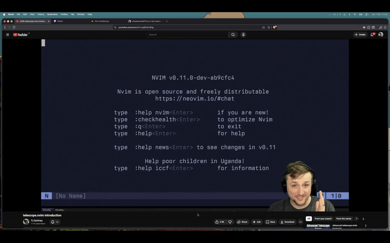

# Fuzzy Tab Search

A lightweight Chrome extension for fuzzy searching open tabs with a keyboard-first overlay.

Inspired by Neovim Telescope and fzf-style workflows.

## Features

- Open overlay with `Cmd+Shift+K` (macOS) or `Ctrl+Shift+K` (Windows/Linux)
- Fuzzy search by tab title and URL
- Navigate results with `Ctrl+N` and `Ctrl+P`
- Open selected tab with `Enter`
- Close overlay with `Esc`

## Preview



## Development

```bash
npm install
npm run compile
```

Load the extension as unpacked in Chrome.
